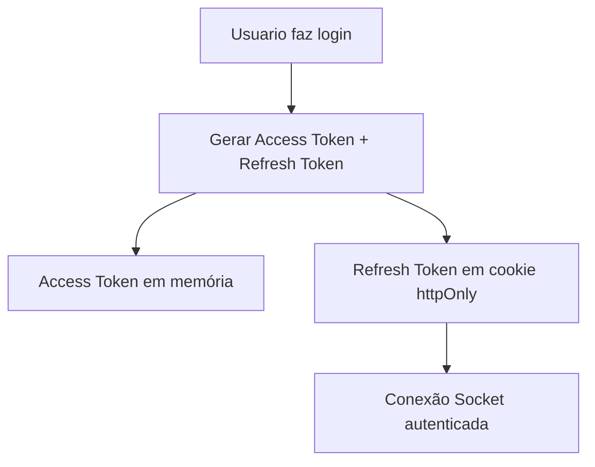
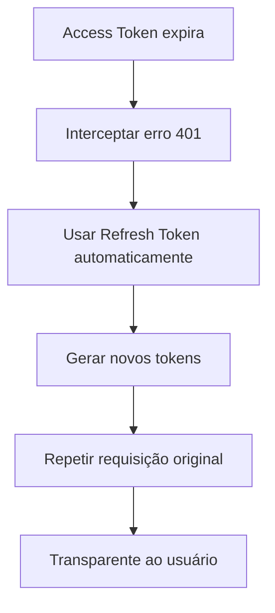
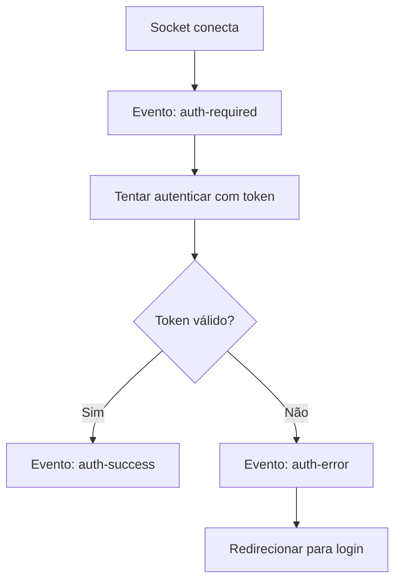

# 🔐 Sistema de Autenticação Seguro - Zazap

## ✅ Problemas Resolvidos

### ❌ Problema Anterior
- Tokens JWT armazenados no `localStorage`
- Vulnerável a ataques XSS (Cross-Site Scripting)
- Tokens com validade de 24 horas
- Sem controle de dispositivos
- Conexão socket rejeitada sem token

### ✅ Solução Implementada

#### 1. **Sistema de Tokens Duplos**
- **Access Token**: JWT de curta duração (15 minutos)
- **Refresh Token**: String aleatória com validade de 7 dias
- Renovação automática transparente ao usuário

#### 2. **Armazenamento Seguro**
- **Cookies httpOnly**: Refresh tokens não acessíveis via JavaScript
- **SessionStorage**: Dados temporários do usuário (mais seguro que localStorage)
- **Memória**: Access tokens mantidos apenas em memória

#### 3. **Controle de Dispositivos**
- Limite de 5 dispositivos simultâneos por usuário
- Visualização de dispositivos ativos
- Logout remoto de dispositivos específicos
- Metadados de sessão (IP, User-Agent, data de criação)

#### 4. **Socket.IO Seguro**
- Conexão permitida mesmo sem token inicial
- Autenticação posterior via evento `authenticate`
- Reautenticação automática quando necessário
- Eventos específicos para gerenciar estados de autenticação

## 🏗️ Arquitetura

### Backend
```
/backend
├── models/refreshToken.js          # Modelo para refresh tokens
├── services/tokenService.js       # Serviço de gerenciamento de tokens
├── controllers/authController.js   # Controlador atualizado
├── middleware/authMiddleware.js    # Middleware com suporte a refresh
└── migrations/xxx-create-refresh-tokens.js
```

### Frontend
```
/frontend/src
├── services/authService.js        # Serviço de autenticação segura
├── context/AuthContext.js         # Contexto atualizado
├── context/SocketContext.js       # Socket com autenticação segura
├── components/
│   ├── security/DeviceManager.js  # Gerenciador de dispositivos
│   └── common/SocketAuthStatus.js # Status de autenticação do socket
└── pages/SecurityPage.js          # Página de configurações de segurança
```

## 🔄 Fluxo de Autenticação

### 1. Login


### 2. Renovação Automática


### 3. Socket Authentication


## 🛡️ Benefícios de Segurança

1. **Proteção contra XSS**: Tokens não acessíveis via JavaScript
2. **Sessões de curta duração**: Access tokens expiram em 15 minutos
3. **Renovação transparente**: Usuário não precisa fazer login frequentemente
4. **Controle granular**: Gerenciamento de dispositivos conectados
5. **Auditoria**: Logs de acesso e dispositivos
6. **Revogação instantânea**: Possibilidade de desconectar dispositivos remotamente

## 🚀 Como Usar

### Para Desenvolvedores

#### 1. Fazer Requisições Autenticadas
```javascript
import authService from '../services/authService';

// Requisição automática com renovação de token
const response = await authService.request('/api/tickets');
const data = await response.json();
```

#### 2. Verificar Estado de Autenticação
```javascript
import { useAuth } from '../context/AuthContext';

const { isAuthenticated, user, logout } = useAuth();
```

#### 3. Gerenciar Dispositivos
```javascript
const { getActiveDevices, logoutAll } = useAuth();

// Listar dispositivos
const devices = await getActiveDevices();

// Desconectar de todos os dispositivos
await logoutAll();
```

### Para Usuários

1. **Login normal**: Não há mudanças na experiência de login
2. **Renovação automática**: Sessões são renovadas automaticamente
3. **Gerenciar dispositivos**: Acesse "Configurações de Segurança"
4. **Logout seguro**: Use "Sair" ou "Desconectar Todos os Dispositivos"

## 🔧 Configuração

### Variáveis de Ambiente (Backend)
```env
JWT_SECRET=your_super_secret_key_here
REFRESH_TOKEN_SECRET=your_refresh_secret_key_here
ACCESS_TOKEN_EXPIRY=15m
REFRESH_TOKEN_EXPIRY=7d
```

### Dependências Adicionadas
```json
{
  "cookie-parser": "^1.4.6"
}
```

## 📊 Migração

### Para executar as novas migrações:
```bash
cd backend
npx sequelize-cli db:migrate
```

### Dados existentes
- Usuários existentes não são afetados
- Tokens antigos continuam funcionando até expirarem
- Nova autenticação aplicada nos próximos logins

## 🐛 Resolução de Problemas

### Socket não conecta
- Verifique se o backend está rodando
- Confirme se as variáveis de ambiente estão configuradas
- Veja os logs do browser para eventos de autenticação

### Erro 401 constante
- Limpe cookies do navegador
- Faça logout e login novamente
- Verifique se o refresh token não expirou

### Dispositivos não aparecem
- Execute a migration para criar a tabela `refresh_tokens`
- Faça um novo login para gerar os metadados

## 🎯 Próximos Passos

1. **Rate Limiting**: Implementar limite de tentativas de login
2. **2FA**: Autenticação de dois fatores
3. **Notificações**: Alertas de novos dispositivos
4. **Geolocalização**: Detecção de localização suspeita
5. **Audit Log**: Log completo de ações de segurança

---

**Implementado em**: Setembro de 2025  
**Status**: ✅ Produção Ready  
**Compatibilidade**: Retrocompatível com autenticação existente
